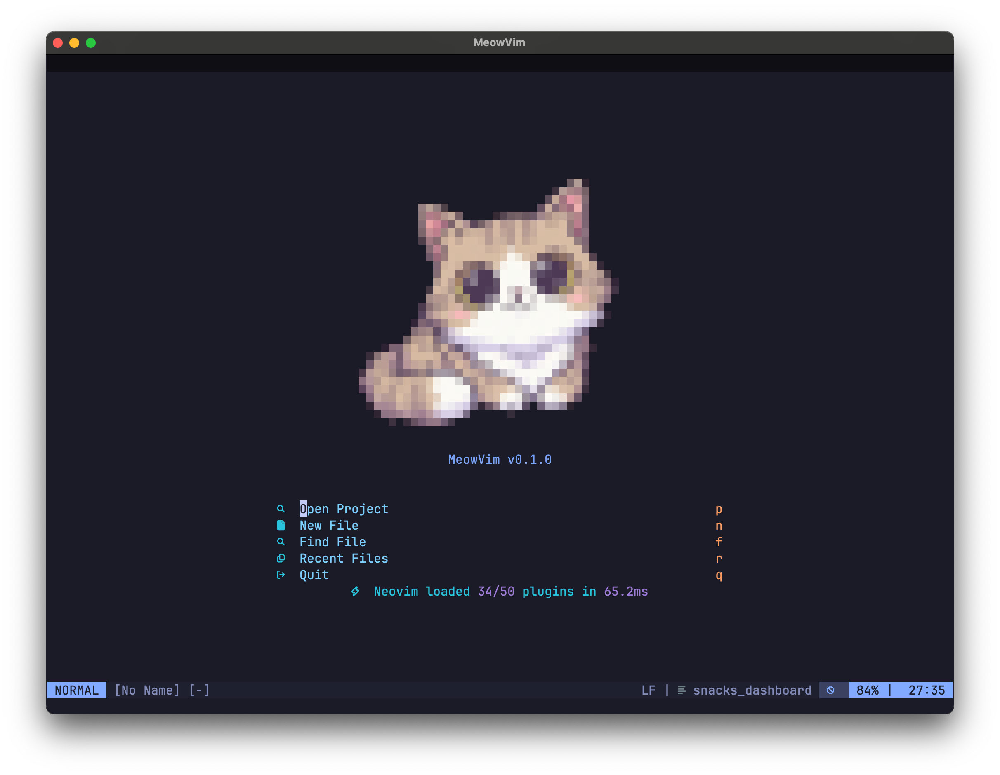
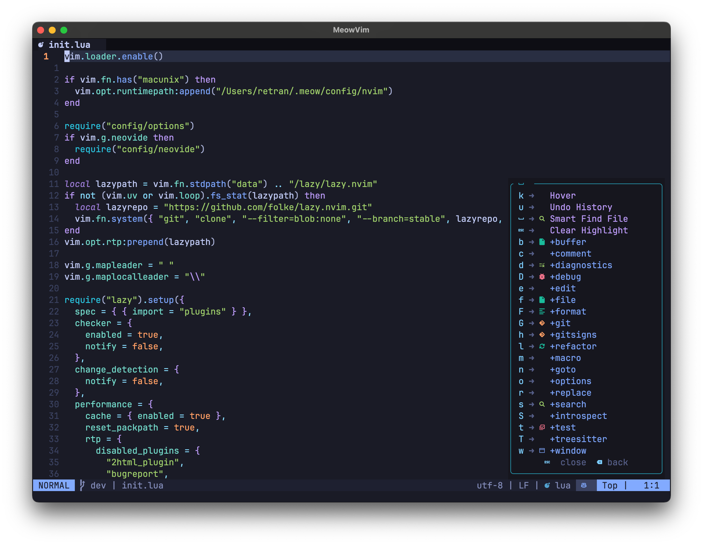

# 🐱 meowvim

> The purr-fect Neovim configuration for a cozy coding session. May or may not increase your productivity by a feline factor.

<div align="center">

   
   
   
   

</div>

<div align="center">

   

   <br>

   <strong>meowvim - Purr-fect Neovim</strong>

</div>

A carefully crafted Neovim configuration that provides a modern development environment. Part of the `project meow`, `meowvim` includes curated plugins, intelligent defaults, and a consistent user experience.

## 🖼️ Screenshots

<div align="center">

### Dashboard



### Editor



</div>

## 🌟 Key Features

- **🚀 Zero Configuration**: Works out of the box with sensible defaults
- **🎨 Modern Interface**: Tokyo Night theme with clean UI components
- **🖥️ GUI Support**: Optimized for both terminal and Neovide GUI experience
- **📱 Raycast Integration**: Quick launcher scripts for macOS productivity
- **🧠 AI-Powered**: GitHub Copilot integration for coding assistance
- **⚡ Performance**: Optimized with lazy loading
- **🔧 Customizable**: Easy to extend and modify
- **🌐 Language Support**: Works with major programming languages
- **📦 Plugin Collection**: 50+ curated plugins for development

## 📋 Table of Contents

- [✨ Features](#-features)
- [📋 Prerequisites](#-prerequisites)
- [🚀 Installation](#-installation)
- [⚡ Quick Start](#-quick-start)
- [⚙️ Configuration](#️-configuration)
- [🔧 Troubleshooting](#-troubleshooting)
- [🤝 Contributing](#-contributing)
- [📄 License](#-license)
- [🙏 Acknowledgments](#-acknowledgments)

## ✨ Features

`meowvim` includes these development features:

### 🧠 Intelligence & Completion

- **LSP Support**: Language Server Protocol integration with automatic setup
- **GitHub Copilot**: AI-powered code completion and suggestions
- **Completion Engine**: Context-aware autocompletion with nvim-cmp
- **Code Snippets**: Snippet collection with LuaSnip
- **Syntax Highlighting**: Syntax highlighting with Treesitter

### 🎨 Interface

- **Tokyo Night Theme**: Modern, readable colorscheme
- **Status Line**: Informative status bar with Git integration
- **Buffer Management**: Buffer navigation and organization
- **Icons**: Consistent iconography throughout
- **Indent Guides**: Visual indentation helpers

### 🔧 Development Tools

- **Git Integration**: Git workflow with Gitsigns and Fugitive
- **Code Formatting**: Automatic formatting with Conform.nvim
- **Linting**: Real-time code linting with nvim-lint
- **Debugging**: Debugging support with nvim-dap and specialized Go support
- **Testing**: Test runner integration with Neotest
- **Note Taking**: Neorg for structured note-taking and documentation

### 🚀 Productivity

- **Fuzzy Finder**: File and text search with Snacks
- **Auto-save**: Automatic file saving
- **Session Management**: Session persistence with persistence.nvim
- **Quick Navigation**: Flash search-based motions for cursor movement
- **Comment Handling**: Treesitter-aware toggles with ts-comments + mini.comment
- **Surround Editing**: MiniSurround for adding/removing surroundings
- **Markup Editing**: Auto-complete and rename tags with nvim-ts-autotag
- **Clipboard History**: Yanky ring with Snacks picker integration
- **Auto-pairs**: Automatic bracket and quote pairing
- **Note Taking**: Neorg integration for organized note-taking
- **Scratch Buffers**: Quick scratch notes and temporary buffers

### 🎯 Language Support

- **Go**: Go development support with testing
- **TypeScript/JavaScript**: JS/TS development
- **Python**: Python development support
- **Lua**: Lua development for Neovim
- **Additional languages**: Extensible language support

## 📋 Prerequisites

Before installing `meowvim`, ensure you have the following:

### Required

- **Neovim** ≥ 0.10.0
- **Git** (for plugin management)
- **A terminal** with true color support

### Recommended

- **Node.js** ≥ 18.0 (for some LSP servers and Copilot)
- **Python** ≥ 3.8 (for Python LSP and some plugins)
- **Go** ≥ 1.19 (for Go development)
- **Ripgrep** (for faster searching)
- **fd** (for faster file finding)
- **fzf** (for fuzzy finding)
- **JetBrains Mono Nerd Font** (for proper icon display)

### Optional

- **GitHub Copilot** subscription (for AI features)
- **Neovide** (for GUI experience with enhanced visual features)

## 🚀 Installation

### Option 1: Fresh Installation

If you're starting fresh or want to replace your current Neovim config:

```bash
# Backup your existing config (if any)
mv ~/.config/nvim ~/.config/nvim.backup

# Clone meowvim
git clone https://github.com/retran/meowvim.git ~/.config/nvim

# Start Neovim - plugins will install automatically
nvim
```

### Option 2: As Part of `meow` System

If you're using [`meow` dotfiles management system](https://github.com/retran/meow):

```bash
# Clone the meow system
git clone https://github.com/retran/meow.git ~/.meow

# Initialize and update submodules (meowvim is connected as submodule)
cd ~/.meow
git submodule init
git submodule update

# Follow the meow installation instructions
./bin/meowctl install personal
```

## ⚡ Quick Start

After installation, follow these steps to get started:

### 1. First Launch

```bash
nvim
```

On first launch, `meowvim` will:

- Install the Lazy.nvim plugin manager
- Download and install all plugins
- Configure Language Server Protocol (LSP) servers automatically

### 2. Basic Navigation

- **Leader key**: `Space` (main entry point for features)
- **Open project**: `Space, f, p` (or `p` from dashboard)
- **Find files**: `Space, f, f` (or `f` from dashboard) 
- **Leap motion**: `Space, Space` for quick cursor jumps
- **Open scratch buffer**: `Space, .`
- **Dashboard navigation**: Use the shortcuts shown on the dashboard

### 3. Set Up GitHub Copilot (Optional)

```vim
:Copilot auth
```

## ⚙️ Configuration

`meowvim` is highly customizable. Here's how to make it your own:

### File Structure

```
~/.config/nvim/
├── init.lua              # Main configuration entry point
├── lua/
│   ├── config/
│   │   ├── options.lua   # Neovim options
│   │   ├── keymaps.lua   # Key mappings
│   │   └── neovide.lua   # Neovide-specific settings
│   ├── plugins/          # Plugin configurations
│   ├── utils/            # Utility functions and patches
├── scripts/              # Helper scripts (icon display)
├── bin/                  # Raycast integration scripts
└── assets/               # Icons and resources
```

### Customizing Options

Edit `lua/config/options.lua` to change Neovim settings:

```lua
-- Example: Change tab width
vim.opt.tabstop = 4
vim.opt.shiftwidth = 4

-- Example: Enable line wrapping
vim.opt.wrap = true
```

### Adding Plugins

Create a new file in `lua/plugins/` directory:

```lua
-- lua/plugins/my-plugin.lua
return {
  "author/plugin-name",
  config = function()
    -- Plugin configuration
  end,
}
```

### Customizing Keymaps

Edit `lua/config/keymaps.lua` to add your own key mappings:

```lua
-- Add your custom keymaps
{ "<leader>mp", ":MyPlugin<CR>", desc = "My Plugin" },
```

### Session Workflow

Session management uses [`persistence.nvim`](https://github.com/folke/persistence.nvim):

- `<leader>ms` – restore the session for the current working directory
- `<leader>ml` – restore the most recent session
- `<leader>mx` – stop saving the current session (useful before quitting)

### Comment Workflow

Commenting is handled by [`ts-comments.nvim`](https://github.com/folke/ts-comments.nvim) and
[`mini.comment`](https://github.com/echasnovski/mini.comment):

- `gcc` – toggle the current line
- `gc{motion}` – toggle a motion (for example, `gc}` or `gcap`)
- `gcb` – toggle a block comment

### Surround Workflow

[`mini.surround`](https://github.com/echasnovski/mini.surround) provides surround manipulation:

- `gsa{motion}{text}` – add surrounds (for example, `gsaiw"`)
- `gsd` – delete the nearest surround
- `gsr` – replace the nearest surround
- `gsh` – highlight the current surround region

### Indent Guides

[`mini.indentscope`](https://github.com/echasnovski/mini.indentscope) is disabled by default. Toggle it with:

- `<leader>og` – enable/disable indent guides for the current session

### Folding

Folding is powered by [`nvim-ufo`](https://github.com/kevinhwang91/nvim-ufo):

- `<leader>oZ` – open all folds
- `<leader>oz` – close all folds
- `<leader>op` – peek folded lines under the cursor

### Theme Customization

Switch themes by editing `lua/plugins/tokyonight.lua`:

```lua
-- Change variant
vim.cmd.colorscheme("tokyonight-storm")  -- or "tokyonight-day"
```

### Note-Taking with Neorg

`meowvim` includes Neorg for structured note-taking:

```lua
-- Notes directory (default: ~/notes)
-- Configure in lua/plugins/neorg.lua
```

Use `:Neorg workspace main` to access your notes workspace.

### Raycast Integration

`meowvim` includes Raycast scripts for quick launching:

- `bin/meowvim.sh` - Launch meowvim with Neovide
- `bin/meowvim-container.sh` - Connect to litterbox container

Copy these scripts to your Raycast script directory to enable quick access.

## 🔧 Troubleshooting

### Common Issues

#### Plugin Installation Fails

```bash
# Clear plugin cache and reinstall
rm -rf ~/.local/share/nvim/lazy
nvim --headless "+Lazy sync" +qa
```

#### LSP Not Working

1. Check if the language server is installed:

   ```vim
   :LspInfo
   ```

2. Language servers are managed by the `meow`. If you installed `meowvim` as part of `meow`, they should be automatically available.
3. For standalone installation, you may need to install servers manually:

   ```bash
   # TypeScript/JavaScript
   npm install -g typescript typescript-language-server

   # Python
   pip install python-lsp-server

   # Go
   go install golang.org/x/tools/gopls@latest

   # Rust
   rustup component add rust-analyzer
   ```

#### Copilot Not Working

1. Authenticate with GitHub:

   ```vim
   :Copilot auth
   ```

2. Check status:

   ```vim
   :Copilot status
   ```

#### Performance Issues

1. Check startup time:

   ```vim
   :StartupTime
   ```

2. Disable unused plugins in `lua/plugins/`

#### Icons Not Displaying

Install [JetBrains Mono Nerd Font](https://www.nerdfonts.com/font-downloads).

### Getting Help

- Use `:help` for Neovim documentation
- Check `:Lazy` for plugin management
- Use `<Space>?` for Which-key help
- Check the [issues page](https://github.com/retran/meowvim/issues)

## 🤝 Contributing

Contributions are welcome to help improve `meowvim`! Here's how you can help:

### Ways to Contribute

- 🐛 Report bugs
- 💡 Suggest new features
- 📝 Improve documentation
- 🔧 Submit code improvements
- 🎨 Enhance themes and UI

## 📄 License

This project is licensed under the MIT License. See the [LICENSE](LICENSE) file for details.

## 🙏 Acknowledgments

`meowvim` builds on the excellent work of the Neovim community.

### Core Dependencies

- [Neovim](https://neovim.io/) - The extensible text editor
- [Lazy.nvim](https://github.com/folke/lazy.nvim) - Modern plugin manager
- [Tokyo Night](https://github.com/folke/tokyonight.nvim) - Beautiful colorscheme

### Plugins

- [auto-save.nvim](https://github.com/okuuva/auto-save.nvim) - Automatic file saving
- [persistence.nvim](https://github.com/folke/persistence.nvim) - Session management and persistence
- [bufferline.nvim](https://github.com/akinsho/bufferline.nvim) - Buffer line with tabs
- [cmp-buffer](https://github.com/hrsh7th/cmp-buffer) - Buffer completion source
- [cmp-nvim-lsp](https://github.com/hrsh7th/cmp-nvim-lsp) - LSP completion source
- [cmp-path](https://github.com/hrsh7th/cmp-path) - Path completion source
- [cmp_luasnip](https://github.com/saadparwaiz1/cmp_luasnip) - LuaSnip completion source
- [conform.nvim](https://github.com/stevearc/conform.nvim) - Code formatting
- [copilot.lua](https://github.com/zbirenbaum/copilot.lua) - GitHub Copilot integration
- [copilot-cmp](https://github.com/zbirenbaum/copilot-cmp) - Copilot completion source
- [copilot-lualine](https://github.com/AndreM222/copilot-lualine) - Copilot status in lualine
- [FixCursorHold.nvim](https://github.com/antoinemadec/FixCursorHold.nvim) - Fix CursorHold performance
- [flash.nvim](https://github.com/folke/flash.nvim) - Search-based jumps and motions
- [friendly-snippets](https://github.com/rafamadriz/friendly-snippets) - Snippet collection
- [gitsigns.nvim](https://github.com/lewis6991/gitsigns.nvim) - Git integration
- [lspkind.nvim](https://github.com/onsails/lspkind.nvim) - LSP kind icons
- [lualine.nvim](https://github.com/nvim-lualine/lualine.nvim) - Status line
- [luarocks.nvim](https://github.com/vhyrro/luarocks.nvim) - Lua package manager
- [LuaSnip](https://github.com/L3MON4D3/LuaSnip) - Snippet engine
- [neodev.nvim](https://github.com/folke/neodev.nvim) - Lua development setup
- [neorg](https://github.com/nvim-neorg/neorg) - Note-taking and organization
- [neotest](https://github.com/nvim-neotest/neotest) - Test runner
- [neotest-go](https://github.com/nvim-neotest/neotest-go) - Go test adapter
- [noice.nvim](https://github.com/folke/noice.nvim) - Improved UI
- [nui.nvim](https://github.com/MunifTanjim/nui.nvim) - UI components library
- [ultimate-autopair.nvim](https://github.com/altermo/ultimate-autopair.nvim) - Auto-pairing
- [nvim-cmp](https://github.com/hrsh7th/nvim-cmp) - Completion engine
- [nvim-dap](https://github.com/mfussenegger/nvim-dap) - Debug adapter protocol
- [nvim-dap-go](https://github.com/leoluz/nvim-dap-go) - Go debug adapter
- [nvim-dap-ui](https://github.com/rcarriga/nvim-dap-ui) - Debug UI
- [nvim-dap-virtual-text](https://github.com/theHamsta/nvim-dap-virtual-text) - Virtual text for debugging
- [nvim-lint](https://github.com/mfussenegger/nvim-lint) - Linting
- [nvim-lspconfig](https://github.com/neovim/nvim-lspconfig) - LSP configuration
- [nvim-nio](https://github.com/nvim-neotest/nvim-nio) - Async I/O library
- [nvim-notify](https://github.com/rcarriga/nvim-notify) - Notification system
- [nvim-treesitter](https://github.com/nvim-treesitter/nvim-treesitter) - Syntax highlighting
- [nvim-treesitter-context](https://github.com/nvim-treesitter/nvim-treesitter-context) - Context display
- [nvim-treesitter-textobjects](https://github.com/nvim-treesitter/nvim-treesitter-textobjects) - Text objects
- [nvim-ts-autotag](https://github.com/windwp/nvim-ts-autotag) - Auto close/rename tags
- [ts-comments.nvim](https://github.com/folke/ts-comments.nvim) - Treesitter-aware commentstrings
- [mini.comment](https://github.com/echasnovski/mini.comment) - Lightweight commenting operator
- [mini.surround](https://github.com/echasnovski/mini.surround) - Surround manipulation
- [mini.indentscope](https://github.com/echasnovski/mini.indentscope) - Indentation guides
- [nvim-web-devicons](https://github.com/nvim-tree/nvim-web-devicons) - File icons
- [plenary.nvim](https://github.com/nvim-lua/plenary.nvim) - Lua utilities
- [SchemaStore.nvim](https://github.com/b0o/SchemaStore.nvim) - JSON schema store
- [snacks.nvim](https://github.com/folke/snacks.nvim) - Collection of utilities
- [yanky.nvim](https://github.com/gbprod/yanky.nvim) - Yank history and enhanced put
- [vim-fugitive](https://github.com/tpope/vim-fugitive) - Git commands
- [vim-rhubarb](https://github.com/tpope/vim-rhubarb) - GitHub integration for fugitive
- [vim-startuptime](https://github.com/dstein64/vim-startuptime) - Startup profiling
- [which-key.nvim](https://github.com/folke/which-key.nvim) - Keybinding help

### Inspiration

- [LazyVim](https://github.com/LazyVim/LazyVim) - Modern Neovim configuration
- [Spacemacs](https://github.com/syl20bnr/spacemacs) - Emacs configuration framework

---

<div align="center">

**Happy coding with `project meow`! 🐱**

Made with ❤️ by Andrew Vasilyev and feline assistants Sonya Blade, Mila, and Marcus Fenix.

[Report Bug](https://github.com/retran/meow/issues) · [Request Feature](https://github.com/retran/meow/issues) · [Contribute](https://github.com/retran/meow/pulls)

</div>
